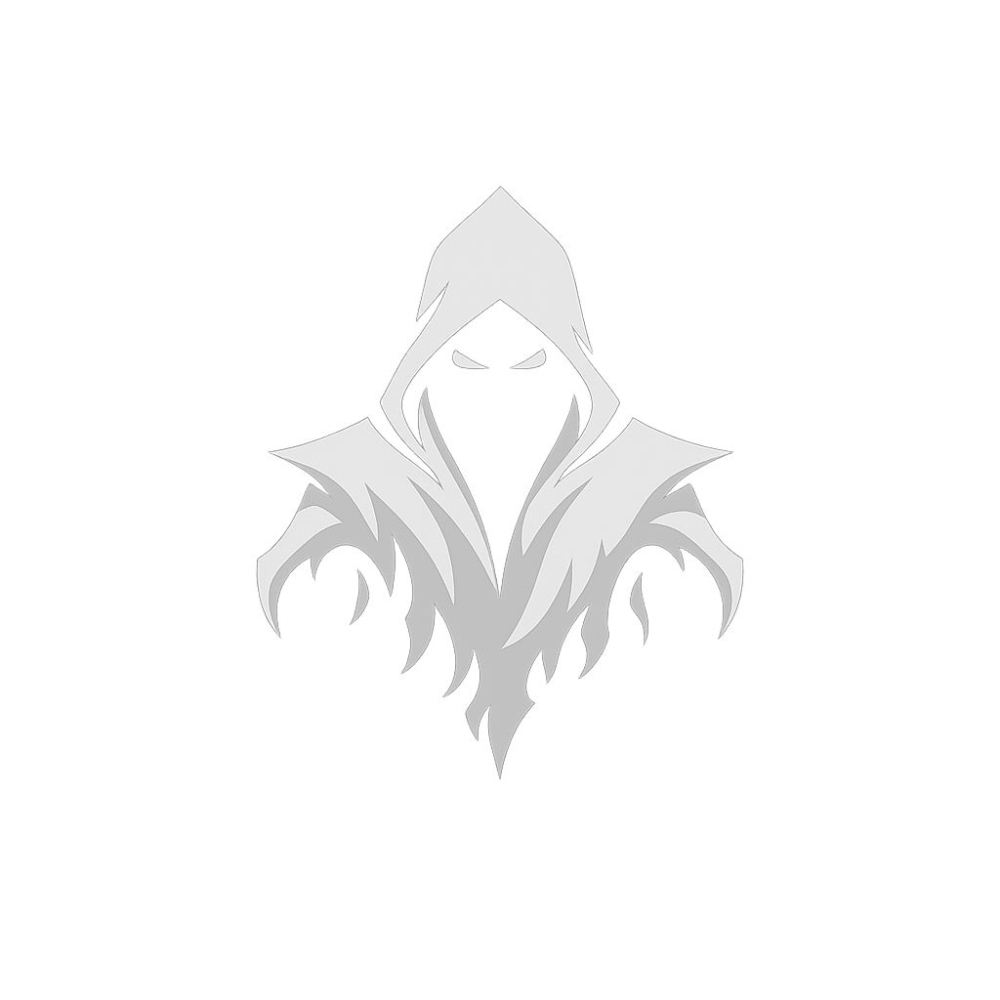

# Wraith Engine

**Modern rendering, backported into the Wrath of the Lich King client.**

Wraith Engine is bringing the retail **Legion 7.3.5** render path to the **WotLK 3.3.5a
(build 12340)** client - modern models, modern shaders, and a real **Direct3D 12** device -
without replacing the client, the data, or the protocol you already run.

**Think of it as Proton for WoW.** Today the engine *translates* modern (Cata+) model and shader
structures into the format the old client understands, so you get modern content on screen *now*.
The long game is the opposite: as we fully map the model and render systems, the translation layer
retires and our **own renderer** takes over - until TLK's D3D9 draws nothing and the entire frame
goes through D3D12.

It's a compatibility shim that is **deliberately built to be thrown away in pieces.** That's the
whole ambition.

## The two phases

Wraith Engine moves the client forward one subsystem at a time, so it stays playable the whole way.

**Phase 1 - Translation (where we are).**
Modern structures are *converted* into what the 3.3.5a engine already knows how to draw. The native
D3D9 path stays in charge; we just feed it content it was never meant to handle. Maximum visible
result, minimum native code - the fastest route to modern assets in-game.

**Phase 2 - Native (where we're headed).**
Every structure we fully understand stops being translated and starts being rendered directly by
our own D3D12 renderer. The shims fall away subsystem by subsystem. End state: **100% native,
D3D9 retired, the whole frame on D3D12.**

The bridge between the two is understanding: you can't render something natively until you've fully
mapped it. That's why reverse-engineering is the heart of this project - see [Documentation](#the-repositories).

## How it works

Wraith Engine lives *inside* the running client. No launcher replacement, no patched data files -
just three pieces that hook the binary you already own:

- **A patcher** that performs PE surgery on `Wow.exe` so the engine loads cleanly at startup.
- **A core module** that brings up the hook engine and installs the model, shader, and texture
  features (modern `MD21` models transcoded to the native contract; modern `BLS` shaders decoded
  on the load path).
- **A `d3d9.dll` proxy** that forwards the real device while forcing **D3D9On12** onto a D3D12
  device Wraith Engine owns - the foothold the native renderer grows from.

Everything operates clean-room on a client you supply. No Blizzard code, no Blizzard assets.

## The repositories

This organization is split by purpose. Start wherever fits you:

| Repository | What's inside |
|---|---|
| **Engine** | The client-side runtime - patcher, hooks, the M2 backport, the D3D12 path. The thing that runs. |
| **Documentation** | The knowledge base. An integrated **Wiki** documenting our findings in our own words - format specs, structure layouts, and offsets - kept as the source of truth the code follows. |

> Links land here as repositories go public. If you're looking for *how the engine actually works
> under the hood*, the **Documentation Wiki** is the real map - the code follows it, not the other
> way around.

## Project status

Early, with deep foundations. The injection chain, the model backport, and the D3D9On12 → D3D12
bridge are working; the modern shader path is live for a first target and widening. This is **Phase 1**
- a working skeleton with a long, deliberate roadmap, not a finished product.

If you're here for screenshots, come back in a while. If you're here to help map an engine, you're
early in the best way.

## Get involved

Two skill sets move this forward fastest:

- **Reverse engineers** - map new subsystems and record them in the Documentation Wiki. Every native
  render path starts as an RE finding.
- **Model & asset backporters** - stress the model translation against real modern assets and report
  what renders wrong.

New here? Read the Documentation Wiki first, then open an issue before any large change so we can
agree where it lands.

**Wraith Engine is an interoperability project.** It distributes no Blizzard code and no game
assets, and runs only against a client you supply and own - reading that client's own files at
runtime. Reverse-engineering is limited to what is necessary for interoperability.

World of Warcraft and Wrath of the Lich King are trademarks of Blizzard Entertainment.
This project is not affiliated with or endorsed by Blizzard.

