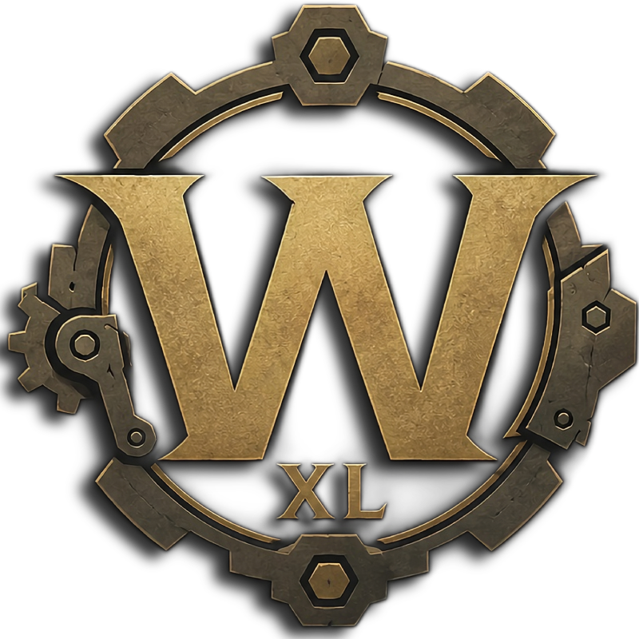

<div align="center">



# WarcraftXL

**A modding framework for the World of Warcraft 3.3.5a client.**

</div>

<div align="center"></div>

WarcraftXL - *Warcraft eXtension Layer* - loads into the running 3.3.5a (build 12340) client and
gives mods a clean, typed way to talk to the engine. Same idea as **SKSE** for Skyrim or **RED4ext**
for Cyberpunk 2077: the framework owns the hard, repetitive parts - getting into the process, the
hook engine, client offsets, engine bindings, an event bus, file-format contracts - so your mods can
just be features.

> **Core principle.** If something is needed everywhere and always works the same way, it belongs in
> the core. Anything that's a *feature* - a decision, an effect, an editor - is a module. The core
> stays small and reusable; the modules stay free to do whatever they want.

<div align="center"></div>

## How it works

`WarcraftXL.dll` boots inside the client, brings up the hook engine, and raises a set of events. A
**module** is a small, self-contained unit that subscribes to those events and uses the core's typed
bindings to read and drive the game. Drop a module in, rebuild, and it's live - no separate injector,
no patched data files.

The core is four pillars, so a module never touches a raw address itself:

| Pillar | What it gives a module |
|---|---|
| **Offsets** | The curated client addresses and struct layouts. Internal - modules never include these directly. |
| **Bindings** | Typed, zero-overhead calls into engine functions, plus an enumerable catalog of `{name, address, signature}`. |
| **Events** | A lightweight event bus. A module subclasses `EventScript` and binds its own methods to engine events. |
| **Assets** | In-memory contracts for the client's file formats (ADT, WMO, M2, WDT, WDL) - so modules read structured data, not byte soup. |

A module is just this - bind in the constructor, react in the handler:

```cpp
class MyModule final : public wxl::events::EventScript {
public:
    MyModule() { on<&MyModule::OnEndScene>(wxl::events::Event::OnEndScene); }
    void OnEndScene(const wxl::events::EndSceneArgs& a) { /* draw, read world, edit... */ }
};
MyModule g_myModule; // file-scope instance self-registers at load
```

<div align="center"></div>

## What you can build

The framework ships with example modules that double as proof and as starting points:

- **[wxl-mini-noggit](https://github.com/WarcraftXL/wxl-mini-noggit)** - an in-client map editor. Pick a doodad, then move, rotate, and scale it live with
  a 3D gizmo, right inside the running game. *(ImGui + ImGuizmo.)*
- **[wxl-unit-outline](https://github.com/WarcraftXL/wxl-unit-outline)** - a unit outline / highlight effect.
- **[wxl-glue-unlock](https://github.com/WarcraftXL/wxl-no-gluexml)** - unlocks the glue (login) screen.

If a map editor *inside the client* is the "hello world", you can imagine what is possible.

<div align="center"></div>

## The organization

Split by purpose - start wherever fits you:

| Repository | What's inside |
|---|---|
| **wxl-core** | The framework: the SDK (offsets, bindings, events, assets), the runtime. The thing that loads into the client. |
| **Documentation** | The knowledge base - an integrated **Wiki** documenting our findings in our own words: format specs, structure layouts, offsets. The source of truth the code follows. |

> Links land here as repositories go public.

<div align="center"></div>

## Status

Early, with solid foundations. The injection chain, the four core pillars, and the first example
modules/scripts are working. The SDK surface is still moving as more of the client gets mapped - expect
sharp edges, and expect them to get filed down fast.

<div align="center"></div>

## Get involved

- **Module/Script authors** - build a feature against the SDK. The example modules/scripts are your template; the
  event bus and the bindings are your toolkit.
- **Reverse engineers** - map new client subsystems and record them in the Documentation Wiki. Every
  new binding starts as an RE finding.

<div align="center"></div>

## Support

**WarcraftXL is free, and it always will be forever.**

Nothing here is gated, and nothing ever
will be. Sponsoring is completely optional - just a way to support the project and the time behind
it, if you want to and can.

<p align="center">
  <a href="https://github.com/sponsors/iThorgrim"></a>
</p>

<div align="center"></div>

<div align="center">

**WarcraftXL is an interoperability project.** It distributes no Blizzard code and no game assets,
and runs only against a client you supply and own, reading that client's own files at runtime.
Reverse-engineering is limited to what is necessary for interoperability.

World of Warcraft and Wrath of the Lich King are trademarks of Blizzard Entertainment.
This project is not affiliated with or endorsed by Blizzard.

Released under the **GNU General Public License v3.0**.

</div>